# DIY Marauder

I have made this project because it was my first ever pcb project and I started with blueprint, I wanted something cool looking, like pentesting device for ethical hacking and as a experimental gadget that I could programm whatever way I wanted to do something cool and finally bring the code to life.

A custom macro keypad / pentesting node based on the Seeed XIAO ESP32S3 (originally designed for RP2040). Designed in KiCad and Fusion 360.

## Project Features

* **Microcontroller:** Seeed XIAO ESP32S3 (USB-C) *(Swapped from RP2040 due to delivery issues)*
* **Display:** 0.96" OLED (I2C) *(Swapped from 0.91")*
* **Controls:** 1x EC11 Rotary Encoder + 2x Mechanical MX Switches
* **Case:** Custom 3D printed snap-fit enclosure

## Gallery
### Build Preview
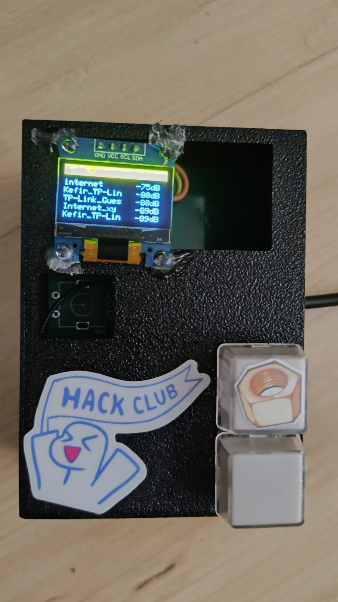
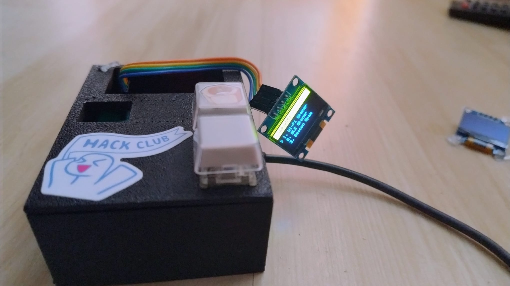
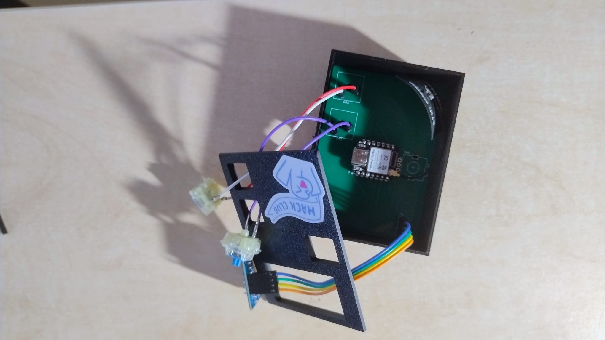

### Schematic
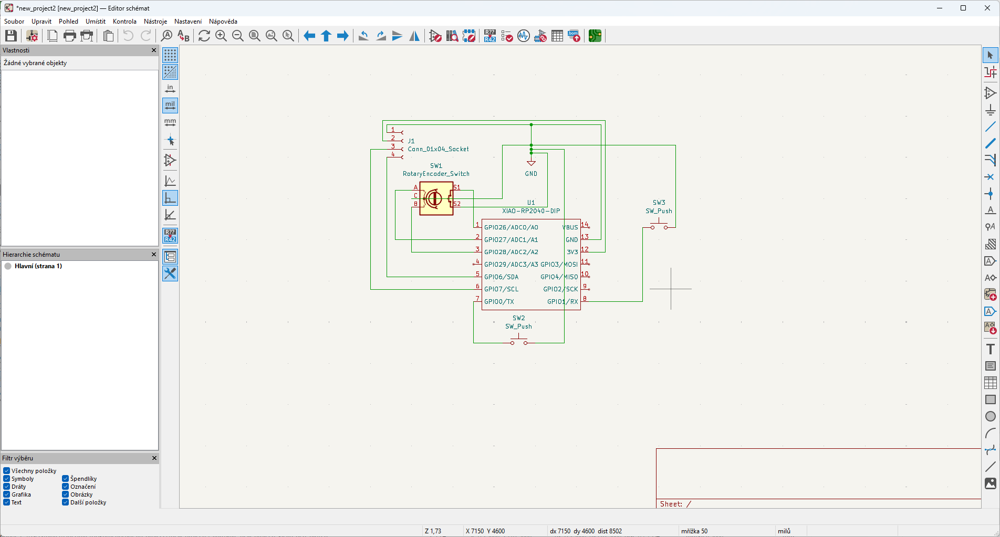

### PCB Routing
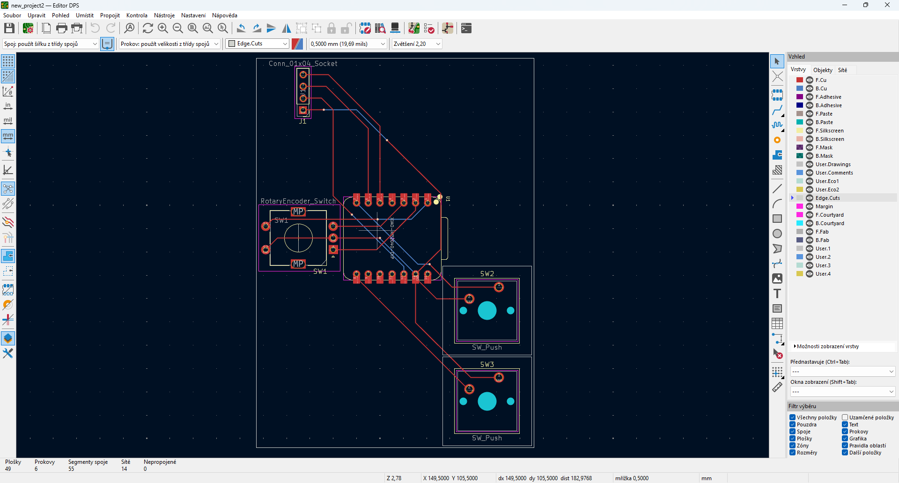

### 3D PCB Render
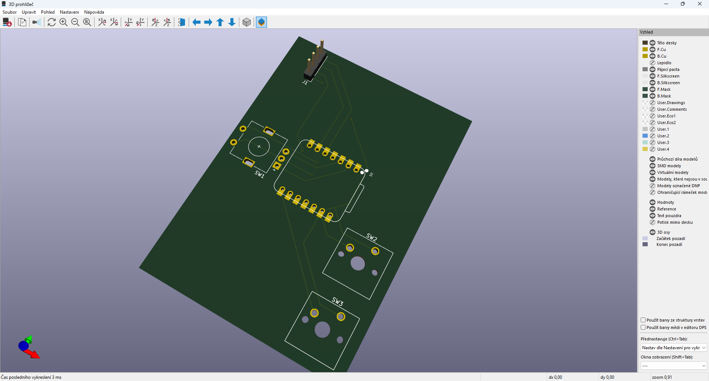

### 3D Printed Case
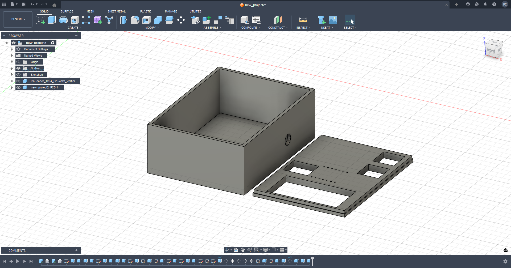

### Assembly Preview
The PCB fits perfectly inside the custom 3D printed case (designed with 0.4mm clearance).
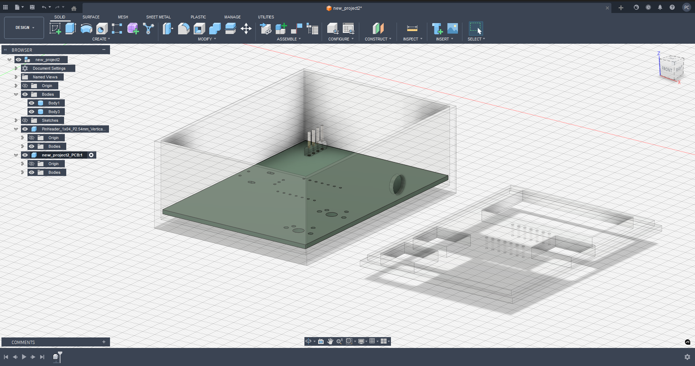

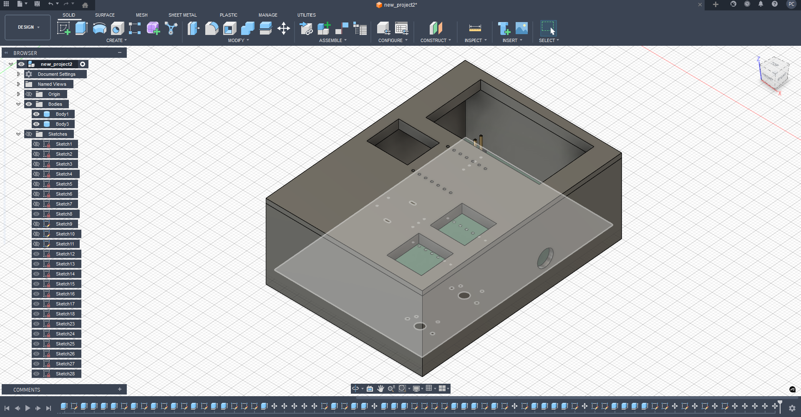

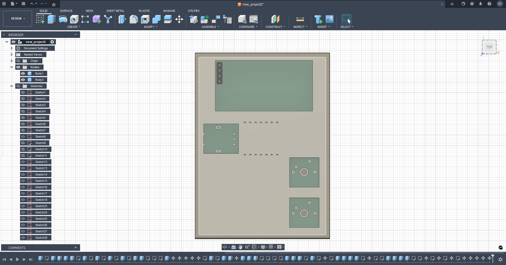

### Assembly Preview Seeed XIAO RP2040

---

Here is the updated BOM, previously I would have used XIAO RP2040, but since there was that customs delivery issues, I bought and used some of the remaining components from zeropad project

## Bill of Materials (BOM)

| Component | Qty | Purpose / Description | Price (USD) | Link / Distributor |
| :--- | :---: | :--- | :--- | :--- |
| **Seeed XIAO ESP32S3** | 1 | Microcontroller (Used instead of RP2040 due to delivery issues). | ~$7.50 | [Botland](https://botland.cz/moduly-wifi-a-bt-esp32/22878-seeed-xiao-esp32-s3-wifi-bluetooth-seeedstudio-113991114.html) |
| **0.96" I2C OLED Display** | 1 | Screen to show UI and analysis data (Swapped from 0.91"). | ~$2.00 | [AliExpress](https://a.aliexpress.com/_EGSrJ7g) |
| **EC11 Rotary Encoder** | 1 | Navigation control with push button. | ~$1.50 | [SparkFun](https://www.sparkfun.com/products/9117) |
| **Cherry MX Switches** | 2 | Secondary input buttons (Sourced from previous build). | ~$6.08 | [AliExpress](https://a.aliexpress.com/_EuLENRY) |
| **1U Blank Keycaps** | 2 | Standard covers for the mechanical switches. | ~$3.35 | [AliExpress](https://a.aliexpress.com/_Eyx6JJo) |
| **Knob** | 1 | Cap for the rotary encoder. | ~$1.50 | [SparkFun](https://www.sparkfun.com/products/10597) |
| **3D Printed Case** | 1 | Enclosure. Files in `3D_Models` folder. | $0.00 | printing legion |

---

## Folder Structure
* **Gerbers:** Manufacturing files ready for JLCPCB.
* **KiCad_Source:** Editable project files for KiCad.
* **3D_Models:** STL and STEP files for printing.

Journals - 
I am really sorry for the confusion, I thought that I was just submitting it for design review at first in stasis and I noticed it just now, however somehow it shows that it was submitted for build review, so I am adding the journals that I wanted to write in stasis there with time - I hope that it will be okay like this and also thank you for the review! : Journals - 

1. journal - soldering and first testing - 4 hours

Before that I have obviously spent a lot of time witch searching the cheapest esp32s3 xiao, which I could get, since these devices were not exatly cheap in czech republic or aliexpress and also wrote some firmware even before that although I still have not it working because I was still missing the keycaps and cherry mx switches which I used from the zeropad projet which arrived on monday, so I still had some time to build it.
I started by soldering everything. First I soldered the esp32-s3, but then I hit some major issues. I was struggling with how to mount the Cherry MX switches because the enclosure was so high and I needed them fixed at the top. It eventually hit me I could just place the switches in that top space and connect them from the bottom using jumper wires through the tht pads. So I soldered pin headers to the pcb on the bottom and then I soldered female jumpers to the switches and connected them. I did that twice.
After that I ran into another problem. Because of the postal service I did not have the encoder I ordered so I tried to scavenge one from around the house. I spent forever searching through the garage until I finally realized I could grab an encoder from an old grill. Finding the screwdriver to open it up in that messy garage was not easy but I managed to dismantle it only to realize it did not have any pins so it was absolutely useless. I just wasted my time.
Anyway I managed to get the display working. I used a pin header on the pcb and connected the screen via jumpers. After the hardware was somewhat assembled I had to actually make it do something useful. I did not want this to be just a simple script I wanted a standalone tool for network analysis. Since my plan to use a scavenged grill encoder failed I had to rely entirely on the two Cherry MX switches. This meant I could not just use a standard library for the menu so I had to write a custom UI system from scratch. I built a scrollable menu interface that dynamically adjusts to the oled screen. Writing a state machine for the button debouncing to handle both short and long presses took way more time than I expected but it was necessary to make the navigation feel responsive.
The firmware itself is around 1100 lines of c++ code. I implemented a wifi scanner and analyzer that scans 2.4ghz bands grabs rssi encryption types and mac addresses. I even added a visual channel analyzer to see where the interference is. Then I added a ble scanner to find bluetooth devices around and sort them by signal strength. Since this is meant to be portable I also implemented a deep sleep mode to save power when it is not actively scanning. Getting the display library to play nice with the specific i2c pins i routed on my pcb required some tweaking but once the display initialized it was satisfying.
Looking back considering this was my first pcb I did some pretty stupid things. I have no idea what I was thinking. First off I did not even realize i could use a gnd filled zone or plane so I just routed gnd traces everywhere but whatever it works. The real problem was the 3d case. For some reason I made a circular hole for the usb-c port not realizing I needed to fit the whole connector through it not just the cable. I literally just made a hole for the cable. Plus I placed the xiao in the middle of the board instead of at the edge so the usb-c port does not stick out properly which looks weird.
I had to fix the hole somehow. I tried sandpaper but that would have taken hours so I went for the radical solution. I grabbed a soldering iron and just ugly-melted the opening bigger despite breathing in all those plastic fumes. It did the trick and the cable fits now. Obviously I did not use my good soldering iron for that just an old destroyed one that was a year old anyway so it does not really matter.
Looking at the final build it is definitely a prototype. The hot glue and the missing encoder do not look professional but the core engineering is solid. I designed the pcb figured out the mechanical mounting for the switches and wrote a custom os for it. It works as a pocket-sized pentesting node. That wrapped up the soldering and assembly. I then started programming and testing the board but I will write about that in the next journal entry.

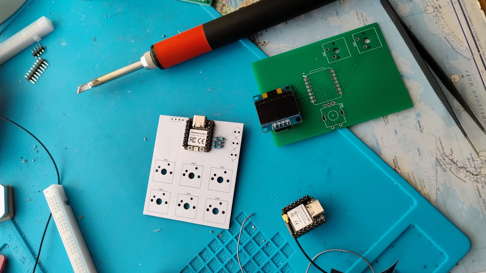
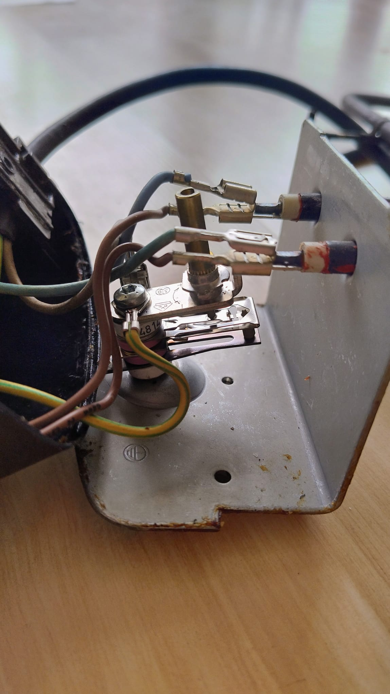
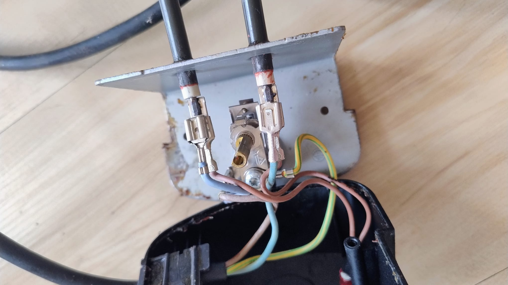
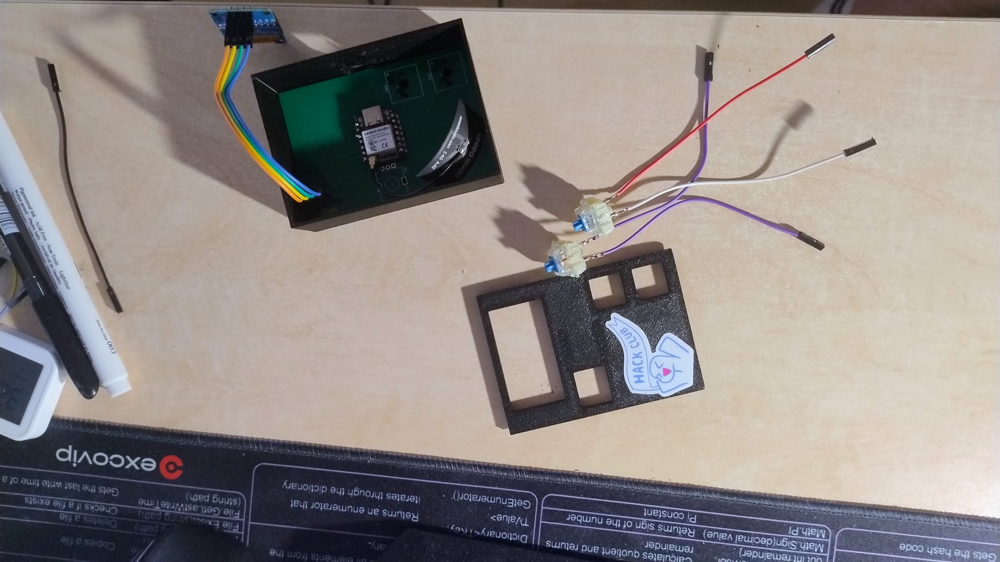
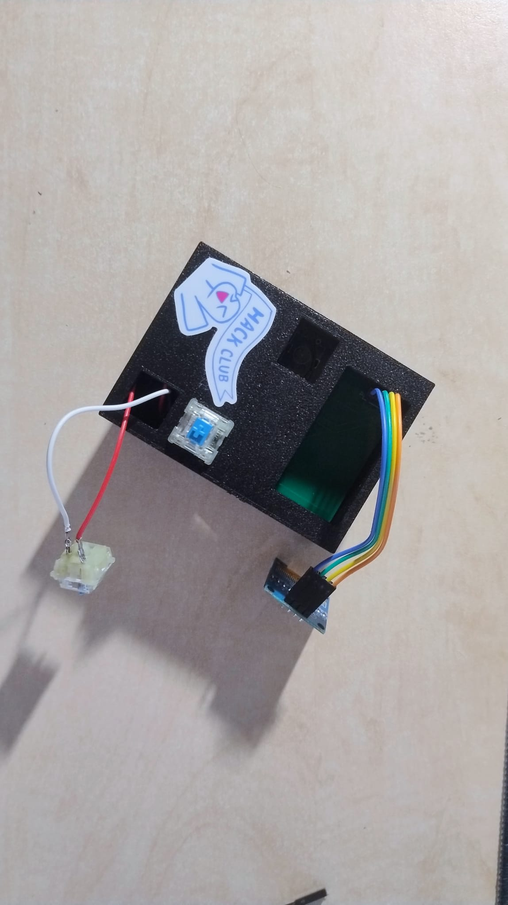
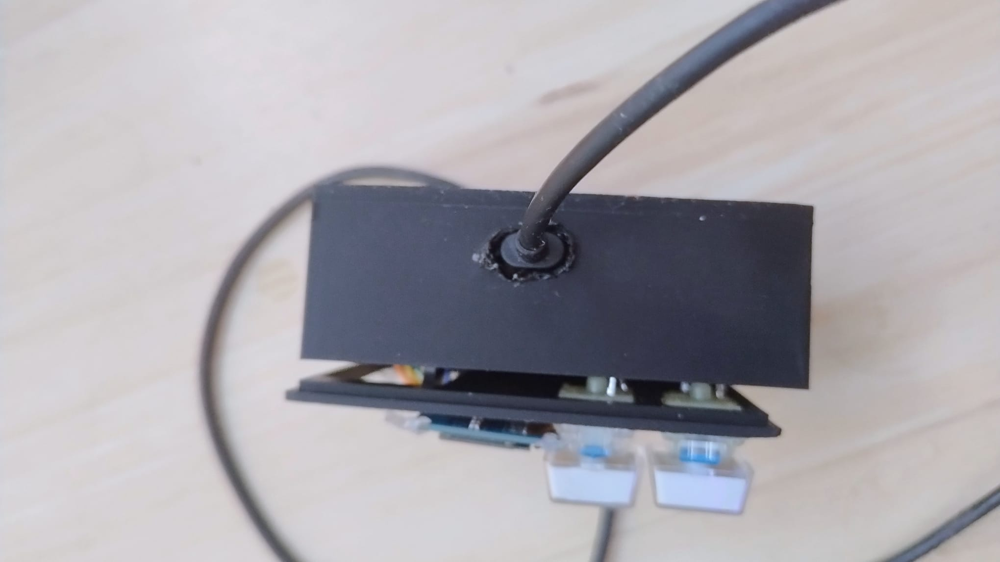
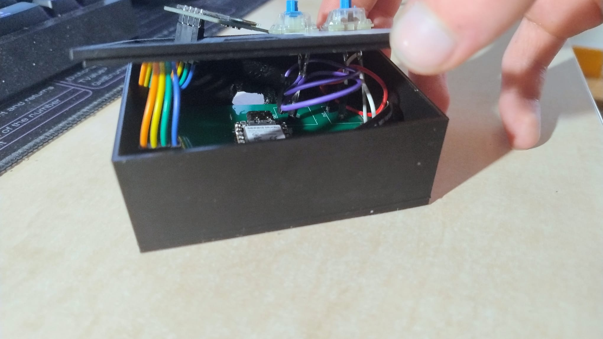
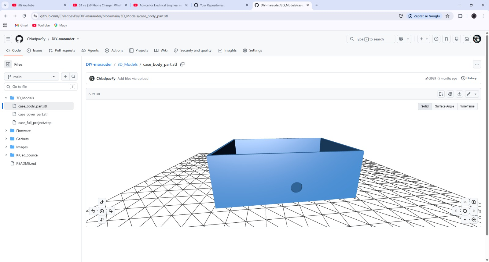
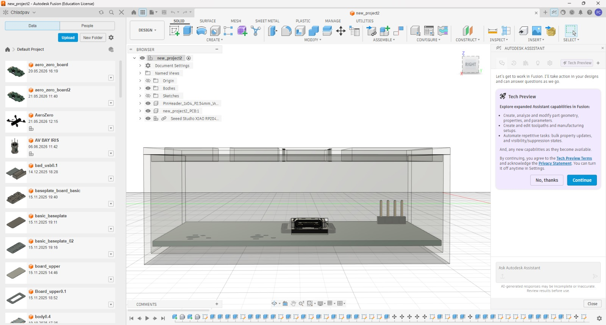
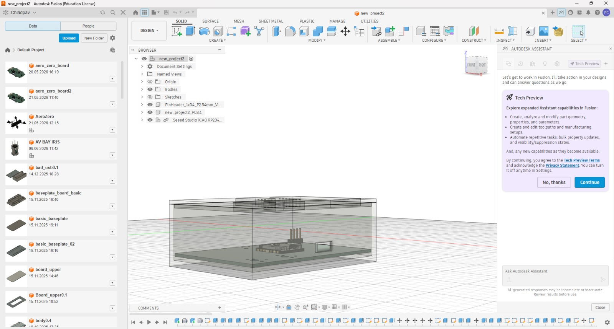

2. journal - writing the firmware and flashing the device - 4 hours 20 minutes
After the hardware was somehow assembled, I had to actually make it do something useful. I did not want this to be just a simple script, I wanted a standalone tool for network analysis. Since my plan to use a scavenged grill encoder failed, I had to rely entirely on the two Cherry MX switches. This meant I could not just use a standard library for the menu, so I had to write a custom UI system from scratch. I built a scrollable menu interface that dynamically adjusts to the OLED screen. Writing a state machine for the button debouncing to handle both short and long presses took way more time than I expected, but it was necessary to make the navigation feel responsive.
The firmware itself is around 1100 lines of C++ code. I implemented a WiFi scanner and analyzer that scans 2.4GHz bands, grabs RSSI, encryption types and MAC addresses. I even added a visual channel analyzer to see where the interference is. Then I added a BLE scanner to find Bluetooth devices around and sort them by signal strength. Since this is meant to be portable, I also implemented a deep sleep mode to save power when it is not actively scanning. Getting the display library to play nice with the specific I2C pins I routed on my PCB required some tweaking, but once the display initialized, it was incredibly satisfying. Looking at the final build, it is definitely a prototype. The hot glue and the missing encoder do not look exactly professional, but the core engineering is solid. I designed the PCB, figured out the mechanical mounting for the switches, and wrote a completely custom OS for it. It works good as a pocket sized pentesting device and even integrated a encoder detection system since I have not got encoder to make it work although I dont have it. I am actually also really amazed what you can actually do with just a esp32 with just 7 pins and also with small 0.96 inch display

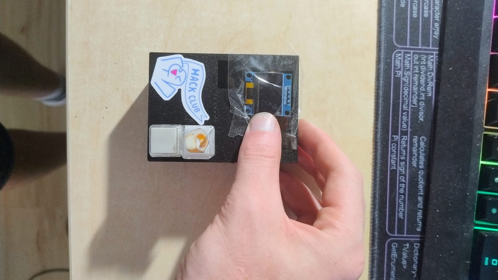
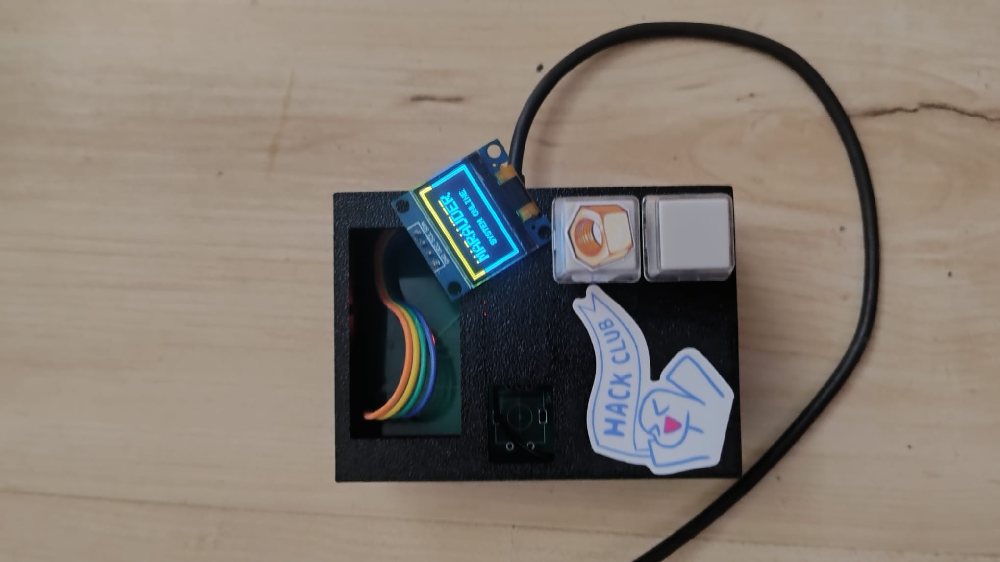
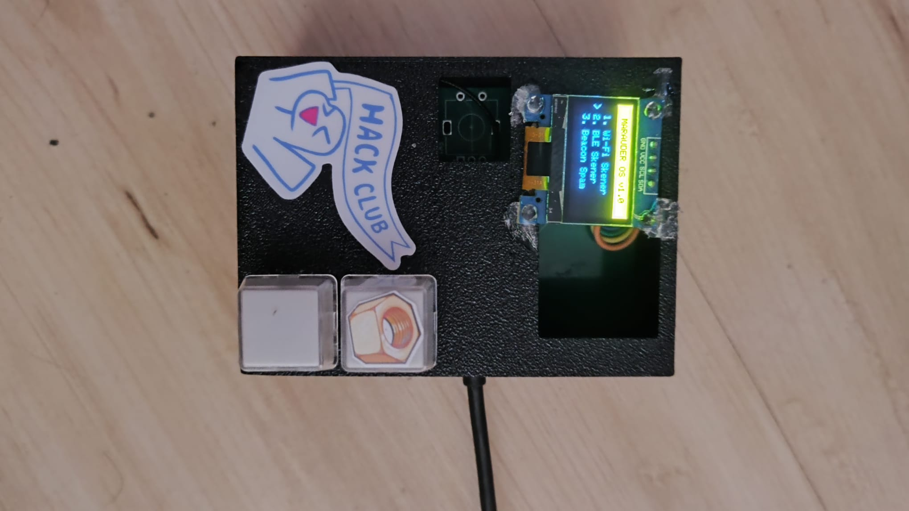

also regarding the BOM in readme I did not have there links before since it should have been shipped from hacklub HQ, but actually updated them and added them because I have used different parts, which was caused by the delivery problems, the only difference would be probably just the performance and that I would not have access to wifi functions with RP2040 otherwise the firmware should be suitable for both devices. - this was a HACKPAD

